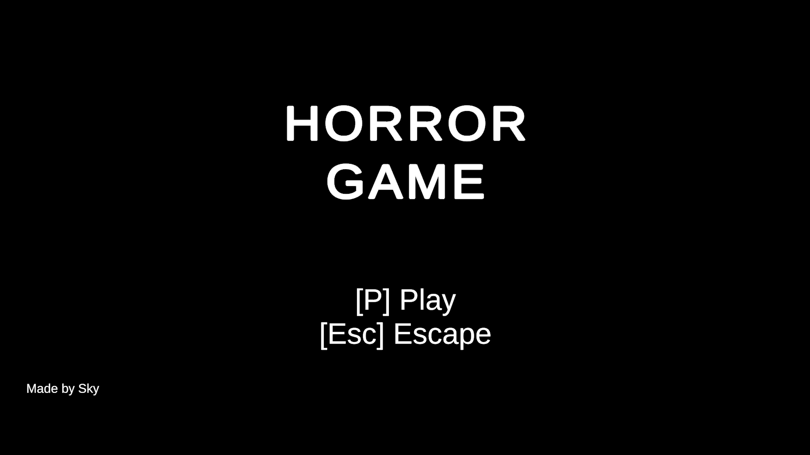
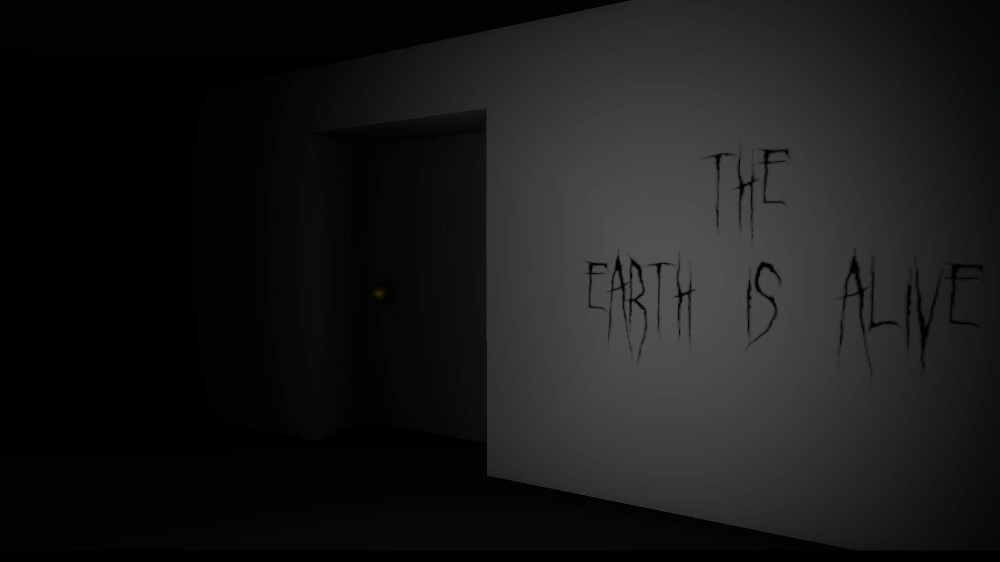

[![Contributors][contributors-shield]][contributors-url]
[![Forks][forks-shield]][forks-url]
[![Stargazers][stars-shield]][stars-url]
[![Issues][issues-shield]][issues-url]
[![Unlicense License][license-shield]][license-url]
[![LinkedIn][linkedin-shield]][linkedin-url]

   <h1>Unity Basic Horror Demo</h1>
   
 
     
    A short, atmospheric horror gameplay demo built to explore Unity's lighting, animation, and interaction systems. Inspired by the Omogonix tutorial series.
   
 

   
   
   
     
    

   <a href="#about-the-project"><strong>Explore the docs »</strong></a>
  

   
Table of Contents

   <ol>
      <li><a href="#about-the-project">About The Project</a></li>
      <li><a href="#built-with">Built With</a></li>
      <li><a href="#file-structure">File Structure</a></li>
      <li><a href="#getting-started">Getting Started</a></li>
      <li><a href="#usage">Usage & Testing</a></li>
      <li><a href="#roadmap">Roadmap</a></li>
      <li><a href="#challenges">Challenges</a></li>
   </ol>

<h2 id="about-the-project">About The Project</h2>

    This project is a <strong>short, linear horror experience</strong> developed to master the fundamentals of atmospheric game design in Unity. Following the tutorial <em>"How to Make a Basic Horror Game"</em> by Omogonix, I focused on building a complete gameplay loop—from a blinking-eye intro to a scripted jumpscare finale.

<a href="#readme-top">↑ Back to Top</a>

<h2 id="built-with">Built With</h2>
<ul>
   <li><strong>Unity:</strong> Primary engine for environment design, lighting, and physics.</li>
   <li><strong>C#:</strong> Custom scripts for flashlight toggling, sprinting, door interactions, and jumpscare triggers.</li>
   <li><strong>Unity Animation Window:</strong> Used for eye-blinks, door hinges, and the monster's rapid movement.</li>
   <li><strong>Native 3D Primitives:</strong> All assets (keys, flashlight, furniture) were modeled using Unity's basic shapes and custom textures/materials for a "lo-fi" aesthetic.</li>
   <li><strong>Audio:</strong> Downloaded and formatted YouTube audio clips for 3D spatial sound effects.</li>
</ul>

<a href="#readme-top">↑ Back to Top</a>

<h2 id="file-structure">File Structure</h2>
<pre>basic-fp-horror-game/
├── .git/                    # Git version control metadata
├── .github/                 # GitHub Actions workflows (e.g., README automation)
├── .vs/                     # Visual Studio configuration files
├── Assets/                  # Core game assets and source files
│   ├── Animations/          # Eye-blinks, door hinges, and monster movement
│   ├── Images/              # Sprites, UI icons, and custom textures
│   ├── Materials/           # Shaders and surface definitions
│   ├── Scenes/              # Main Menu and the Horror Level
│   ├── Scripts/             # C# logic for interaction, movement, and UI
│   ├── Settings/            # Rendering and URP/HDRP configurations
│   ├── Sounds/              # Ambient background music and 3D SFX
│   ├── TextMesh Pro/        # UI font assets and styling
│   └── TutorialInfo/        # Unity project template documentation
├── Packages/                # Unity package dependencies
├── ProjectSettings/         # Unity editor and build configuration
├── UserSettings/            # Local editor layout and preferences
├── .gitattributes           # Git LFS and line ending settings
├── .gitignore               # Files excluded from version control
├── .vsconfig                # Visual Studio component configuration
├── Assembly-CSharp.csproj   # C# project file for IDE integration
├── basic-fp-horror-game.sln # Main Visual Studio solution file
└── README.template.md       # Source for dynamic README generation
</pre>

<a href="#readme-top">↑ Back to Top</a>

<h2 id="getting-started">Getting Started</h2>
<h3>Prerequisites</h3>
<ul>
   <li>Unity Hub</li>
   <li>Unity Editor (2021.x or newer recommended)</li>
</ul>
<h3>Installation</h3>
<ol>
   <li>Clone the repository: <pre>git clone https://github.com/ShenLoong99/basic-fp-horror-game.git</pre></li>
   <li>Open <strong>Unity Hub</strong> and click <strong>Add</strong>.</li>
   <li>Select the project folder.</li>
   <li>Ensure all <strong>Audio Clips</strong> and <strong>Textures</strong> are imported correctly.</li>
   <li>Open <code>Scenes/MainMenu</code> and press <strong>Play</strong>.</li>
</ol>

<a href="#readme-top">↑ Back to Top</a>

<h2 id="usage">Usage & Testing</h2>

<h3>🎮 Gameplay Mechanics</h3>
<ul>
    <li><strong>Exploration:</strong> Move with <code>WASD</code>, Sprint with <code>Shift</code>.</li>
    <li><strong>Interaction:</strong> Walk up to objects; if the invisible "interaction beam" collides, you can toggle doors or pick up items.</li>
    <li><strong>Objective:</strong> Locate the key in the dark hallway, unlock the "Locked Room," and survive the encounter.</li>
</ul>

Watch the sample gameplay at my linkedIn post here: <a href="https://www.linkedin.com/posts/activity-7415352498481467392-mbwU?utm_source=share&utm_medium=member_desktop&rcm=ACoAAC64xbIBQ-4tMrEhn1BXRr8SmkzqiMPX0k8">Basic FP Horror Game</a>

<h3>🛠 Testing Focus</h3>
<ul>
    <li><strong>Collision Triggers:</strong> Ensuring the monster triggers its movement script the moment the player enters the final room.</li>
    <li><strong>UI Responsiveness:</strong> Verifying that texts (e.g., "Press E to Pick Up") show/hide correctly based on the player's proximity.</li>
    <li><strong>Optimization:</strong> Testing the build configurations to ensure stable FPS despite the volumetric fog/particle effects.</li>
</ul>

<a href="#readme-top">↑ Back to Top</a>

<h2 id="roadmap">Roadmap</h2>
<ul>
   <li>[x] Implement first-person movement and "Interaction Beam"</li>
   <li>[x] Create eye-blink intro animation</li>
   <li>[x] Configure dark environment lighting and fog particles</li>
   <li>[x] Add Main Menu and Game Over screens</li>
   <li>[ ] Refactor interaction script to use Interfaces</li>
   <li>[ ] Implement a Raycast-based interaction for better precision</li>
</ul>

<a href="#readme-top">↑ Back to Top</a>

<h2 id="challenges">Challenges</h2>
<table>
   <thead>
      <tr>
         <th>Challenge</th>
         <th>Solution</th>
      </tr>
   </thead>
   <tbody>
      <tr>
         <td><strong>Unity Version Mismatch</strong></td>
         <td>The tutorial used an older UI. I had to manually locate renamed lighting settings and updated prefab workflows.</td>
      </tr>
      <tr>
         <td><strong>Persistent Global Lighting</strong></td>
         <td>
            
            Disabled the skybox, set environment lighting to a flat dark color, and used custom "dark fog" particles to mask the horizon
         </td>
      </tr>
      <tr>
         <td><strong>Monster Behavior</strong></td>
         <td>Fixed an issue where the monster faced away from the player by adjusting the Transform.LookAt logic in the movement script.</td>
      </tr>
      <tr>
         <td><strong>UI Hierarchy</strong></td>
         <td>Organized Canvas elements to ensure the text is displayed when user interacts an object such as door and key.</td>
      </tr>
   </tbody>
</table>

<a href="#readme-top">↑ Back to Top</a>

<h2 id="contact">🙏 Acknowledgements</h2>

Special thanks to <strong><a href="https://www.youtube.com/@Omogonix"><strong>Omogonix</strong></a></strong> for the clear guidance on building a horror atmosphere from scratch using primitive shapes.

🎥 Tutorial Source:<a href="https://www.youtube.com/playlist?list=PLWI8H56cvVoI0xd2FOIDschZbTKXlm71r"><strong>How to Make a Basic Horror Game in Unity (All Parts)</strong></a>

This repository is intended for learning and portfolio showcase purposes only.

[contributors-shield]: https://img.shields.io/github/contributors/ShenLoong99/basic-fp-horror-game.svg?style=for-the-badge
[contributors-url]: https://github.com/ShenLoong99/basic-fp-horror-game/graphs/contributors
[forks-shield]: https://img.shields.io/github/forks/ShenLoong99/basic-fp-horror-game.svg?style=for-the-badge
[forks-url]: https://github.com/ShenLoong99/basic-fp-horror-game/network/members
[stars-shield]: https://img.shields.io/github/stars/ShenLoong99/basic-fp-horror-game.svg?style=for-the-badge
[stars-url]: https://github.com/ShenLoong99/basic-fp-horror-game/stargazers
[issues-shield]: https://img.shields.io/github/issues/ShenLoong99/basic-fp-horror-game.svg?style=for-the-badge
[issues-url]: https://github.com/ShenLoong99/basic-fp-horror-game/issues
[license-shield]: https://img.shields.io/github/license/ShenLoong99/basic-fp-horror-game.svg?style=for-the-badge
[license-url]: https://github.com/ShenLoong99/basic-fp-horror-game/blob/master/LICENSE.txt
[linkedin-shield]: https://img.shields.io/badge/-LinkedIn-black.svg?style=for-the-badge&logo=linkedin&colorB=555
[linkedin-url]: https://linkedin.com/in/si-kai-tan
